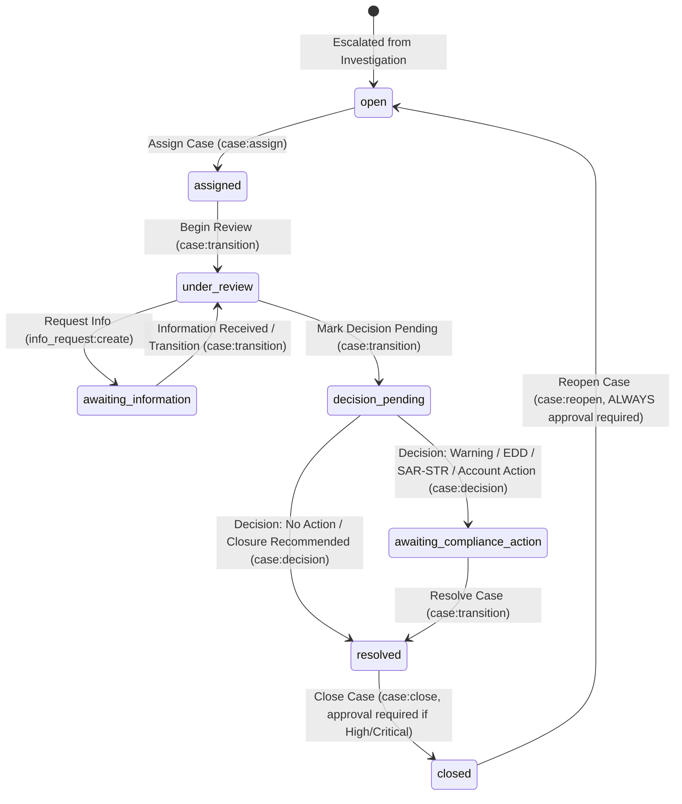
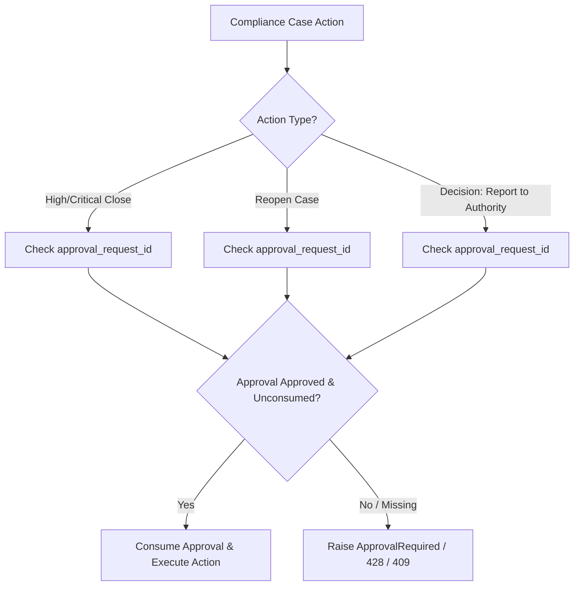

# PHASE 3B.1 — COMPLIANCE CASE WORKFLOW DISCOVERY REPORT

**Baseline Assessment & Case Lifecycle Architecture**  
**Date:** August 16, 2026  
**Status:** COMPLETE (Discovery Phase — No Source Code Mutated)

---

## 1. Executive Summary

This report delivers a thorough discovery of the existing Compliance Case domain in the Banking Intelligence System. As mandated, **no source code or database migrations were created or modified** during this discovery phase.

### Key Discovery Findings
1. **Core Domain Baseline:** The backend Compliance Case domain possesses a robust baseline including data models (`ComplianceCase`, `Decision`), database schemas, unit-of-work transactions, optimistic concurrency control (`version`), approval gating (`ApprovalRequest`), outbox audit events (`AuditOutboxEvent`), activity timeline (`ActivityTimelineEntry`), and notification dispatch.
2. **Authoritative Workflow Boundary:** The operational flow entering the Case domain is verified:
   $$\text{Analyst Alert} \longrightarrow \text{Analyst Investigation} \longrightarrow \text{Submit} \longrightarrow \text{Compliance Review} \xrightarrow{\text{Suspicious/Malicious}} \text{Compliance Case Created}$$
   Compliance Cases represent activity that has passed Analyst investigation and Compliance review, requiring formal compliance handling.
3. **Primary System Gaps Identified:**
   - **Queue Architecture (Gap B/D):** The backend only provides `GET /api/v1/cases/assigned` ("My Cases"). There are no endpoints or frontend queues for **Unassigned Cases** (`assigned_to IS NULL`) or **All Authorized Cases** in scope.
   - **Frontend API & UI Discrepancies (Gap C):** Backend implements `POST /cases/{id}/close` and `POST /cases/{id}/reopen` with strict approval requirements, but frontend `casesApi.ts` and `CaseDetailPage.tsx` omit `close` and `reopen` calls and UI buttons.
   - **Investigation Package Evidence (Gap B):** `CaseDetailPage` embeds `CaseInvestigationTab` showing investigation findings and conclusions, but omits Investigation Evidence Attachments uploaded during Phase 3A.9D.
   - **Regulatory Reporting / SAR-STR (Gap D/E):** "Report to Authority" exists only as a decision type enum (`report_to_authority_recommended`) gated by approval (`decision_report_to_authority`). No formal SAR/STR regulatory filing object or export workflow exists.

---

## 2. Existing Case Architecture

The Compliance Case architecture spans backend services and frontend components:

```
┌─────────────────────────────────────────────────────────────────────────────┐
│                           FRONTEND (React + TS)                             │
│  CaseQueuePage.tsx  │  CaseDetailPage.tsx  │  CaseDecisionsTab.tsx          │
│  CaseInvestigationTab.tsx │ CaseInformationRequestsTab.tsx │ casesApi.ts    │
└──────────────────────────────────────┬──────────────────────────────────────┘
                                       │ HTTP / REST
┌──────────────────────────────────────▼──────────────────────────────────────┐
│                           BACKEND (FastAPI + AsyncPG)                       │
│  routers/cases.py   │  services/case_service.py  │  repos.py (CaseRepo)   │
│  shared/authorise.py │  models.py (ComplianceCase) │ uow.py (UnitOfWork)   │
└─────────────────────────────────────────────────────────────────────────────┘
```

### Backend Components
- **Router:** [services/workbench/routers/cases.py](file:///Users/ihebsayah/Documents/Reporting-app/banking-intelligence-system/services/workbench/routers/cases.py) exposes REST endpoints (`/api/v1/cases/...`).
- **Service Layer:** [services/workbench/services/case_service.py](file:///Users/ihebsayah/Documents/Reporting-app/banking-intelligence-system/services/workbench/services/case_service.py) enforces business logic, idempotency, versioning, timeline entries, notifications, and outbox audit events.
- **Repository:** `CaseRepo` & `DecisionRepo` in [services/workbench/repos.py](file:///Users/ihebsayah/Documents/Reporting-app/banking-intelligence-system/services/workbench/repos.py) execute parameterized PostgreSQL queries.
- **Models & Schemas:** Pydantic schemas in [services/workbench/schemas/cases.py](file:///Users/ihebsayah/Documents/Reporting-app/banking-intelligence-system/services/workbench/schemas/cases.py) and domain models in [services/workbench/models.py](file:///Users/ihebsayah/Documents/Reporting-app/banking-intelligence-system/services/workbench/models.py).
- **Policy Engine:** [services/shared/authorise.py](file:///Users/ihebsayah/Documents/Reporting-app/banking-intelligence-system/services/shared/authorise.py) enforces RBAC, ownership, scope boundaries, workflow state transitions, and Segregation of Duties (SoD).

### Frontend Components
- **Queue Page:** [frontend/src/components/cases/CaseQueuePage.tsx](file:///Users/ihebsayah/Documents/Reporting-app/banking-intelligence-system/frontend/src/components/cases/CaseQueuePage.tsx) renders assigned cases.
- **Detail Page:** [frontend/src/components/cases/CaseDetailPage.tsx](file:///Users/ihebsayah/Documents/Reporting-app/banking-intelligence-system/frontend/src/components/cases/CaseDetailPage.tsx) renders tabs (Overview, Investigation, Information Requests, Decisions, Comments, Timeline) and Customer Context Panel.
- **API Client:** [frontend/src/api/casesApi.ts](file:///Users/ihebsayah/Documents/Reporting-app/banking-intelligence-system/frontend/src/api/casesApi.ts) connects frontend components to `/api/v1/cases` endpoints.

---

## 3. Case State Machine

The authoritative Case state machine is defined in `case_service.py` (`ALLOWED_TRANSITIONS`) and `authorise.py` (`CASE_TRANSITIONS`).



### Detailed Transition Matrix

| FROM | TO | Service Method | Endpoint | Required Permission | Allowed Role | Side Effects / Audit / Approval |
| :--- | :--- | :--- | :--- | :--- | :--- | :--- |
| `open` | `assigned` | `assign()` | `PATCH /cases/{id}/assign` | `case:assign` | Admin / Compliance | Timeline `case.assigned`, notification `case_assigned`, outbox `case.assigned` |
| `assigned` | `under_review` | `transition()` | `PATCH /cases/{id}/transition` | `case:transition` | Assignee (Compliance) | Timeline `case.under_review`, outbox `case.under_review` |
| `under_review` | `awaiting_information` | `create_information_request()` | `POST /cases/{id}/information-requests` | `info_request:create` | Assignee (Compliance) | Sets case status to `awaiting_information`, creates IR record, outbox `case.awaiting_info` |
| `awaiting_information` | `under_review` | `transition()` | `PATCH /cases/{id}/transition` | `case:transition` | Assignee (Compliance) | Resumes review. Timeline `under_review_resumed`, outbox `case.resumed` |
| `under_review` | `decision_pending` | `transition()` | `PATCH /cases/{id}/transition` | `case:transition` | Assignee (Compliance) | Timeline `case.decision_pending`, outbox `case.decision_pending` |
| `decision_pending` | `resolved` | `record_decision()` | `POST /cases/{id}/decisions` | `case:decision` | Assignee (Compliance) | Decision type: `no_action` or `closure_recommended`. Timeline `case.resolved`, outbox `case.resolved` |
| `decision_pending` | `awaiting_compliance_action` | `record_decision()` | `POST /cases/{id}/decisions` | `case:decision` | Assignee (Compliance) | Decision type: `warning`, `edd`, `report_to_authority`, `account_action`. If `report_to_authority`, **Requires Approved** `decision_report_to_authority` Approval Request ID |
| `awaiting_compliance_action` | `resolved` | `transition()` | `PATCH /cases/{id}/transition` | `case:transition` | Assignee (Compliance) | Resolution text required. Timeline `case.resolved`, outbox `case.resolved` |
| `resolved` | `closed` | `close()` | `POST /cases/{id}/close` | `case:close` | Compliance | Resolution text required. **If Risk is High or Critical, Requires Approved** `case_closure_critical_high` Approval Request ID. Resolves linked alert |
| `closed` | `open` | `reopen()` | `POST /cases/{id}/reopen` | `case:reopen` | Compliance | Reopen reason required. **ALWAYS Requires Approved** `case_reopen` Approval Request ID |

---

## 4. Case Creation

Case creation from an Investigation is implemented in Phase 3A.9C / P2 (`investigation_service.py`):
- **Trigger:** Compliance Officer reviews a submitted Investigation (`POST /api/v1/investigations/{id}/review`) with action `escalate_to_case` or decision `suspicious`/`malicious`.
- **Field Mapping:**
  - `case_id`: Generated UUID.
  - `investigation_id`: Passed from investigation.
  - `alert_id`: Extracted from `investigation.alert_id`.
  - `scope_id`: Copied from `investigation.scope_id`.
  - `title`: Provided in review request.
  - `priority`: Provided in review request.
  - `assigned_to`: Set to `None` (unassigned initially).
  - `created_by`: Set to `user.user_id` (the reviewing Compliance Officer).
  - `status`: Defaults to `"open"`.
- **Duplicate Prevention:** App-level check `CaseRepo.fetch_active_for_investigation()` raises HTTP 409 `DUPLICATE_ESCALATION` if an active case already exists for the investigation.
- **Reference-Based Customer Resolution:** No customer data is duplicated in `ComplianceCase`. Customer 360 is resolved dynamically through:
  $$\text{ComplianceCase} \longrightarrow \text{Alert / Investigation} \longrightarrow \text{resolved\_customer_id} \longrightarrow \text{CustomerContextPanel}$$

---

## 5. Case Ownership & Assignment

- **Initial State:** Newly created Cases start **unassigned** (`assigned_to = None`, status `open`).
- **Assignment Method:** `CaseService.assign()` validates that target assignee is an active user with access to `c.scope_id`.
- **Permissions:** `case:assign` (Admin or authorized Compliance Supervisor).
- **Ownership Model:** Operational actions (`transition`, `record_decision`, `close`) require the user to be the **current assignee** (`assigned_to == user.user_id`).
- **Assignment History:** Every assignment action creates an `AssignmentHistoryEntry` and logs a timeline entry `case.assigned`.

---

## 6. Case Queues Architecture

| Queue Type | Backend Support | Endpoint | Frontend Support | Status / Gap |
| :--- | :--- | :--- | :--- | :--- |
| **My Cases** | Supported | `GET /api/v1/cases/assigned` | `CaseQueuePage.tsx` | Complete |
| **Unassigned Cases** | **Missing** | None | None | **GAP B:** Needs `GET /api/v1/cases/unassigned` and queue tab |
| **Open Cases** | Partial | Filter on `assigned` | Filter dropdown | Uses client filter on assigned list |
| **All Authorized Cases** | **Missing** | None | None | **GAP D:** Scope/supervisor view missing |
| **Pagination & Filtering** | Supported | `page`, `per_page`, `status`, `priority` | Supported | Server-side filtering enforced |

---

## 7. Case Detail Capabilities

`CaseDetailPage.tsx` currently renders:
- **Header & Summary:** Badges for Status, Risk, Priority, Version, Assignee.
- **Tabbed Views:**
  1. **Overview:** Workflow next-step guidance, Case Description, Resolution, Linked Alert card, Authorized Customer 360 Context Panel, Metadata grid.
  2. **Investigation:** Embedded `CaseInvestigationTab`.
  3. **Information Requests:** Embedded `CaseInformationRequestsTab`.
  4. **Decisions:** Embedded `CaseDecisionsTab`.
  5. **Comments:** Embedded `CommentsTab` (shared with investigations).
  6. **Timeline:** Embedded `TimelineTab` (shared with investigations).
- **Missing Actions in UI:**
  - `Close Case` button (Backend supports `POST /cases/{id}/close`).
  - `Reopen Case` button (Backend supports `POST /cases/{id}/reopen`).

---

## 8. Investigation Package Integration

`CaseInvestigationTab` fetches the originating `Investigation` record using `investigation_id`.
- **Exposed Context:** Findings text, Findings references, Conclusion, Return reason, Status badge, Priority badge.
- **GAP B Identified:** The tab does NOT display or link Investigation Evidence Attachments (`InvestigationAttachment` / `GET /api/v1/investigations/{id}/attachments`) uploaded during Phase 3A.9D. Compliance Officers must be able to view evidence attached during investigation.

---

## 9. Information Requests

- **Creation:** Compliance Officers create IRs on Cases via `POST /api/v1/cases/{case_id}/information-requests`.
- **Status Gating:** Case MUST be in status `under_review`. Transition sets Case status to `awaiting_information`.
- **Recipient Action:** Recipient (Analyst) responds via `PATCH /information-requests/{id}/respond`.
- **Accept/Return:** Compliance Officer accepts (`PATCH /accept`) or returns (`PATCH /return`).
- **Resumption:** When an IR is accepted, the Compliance Officer receives a notification `ir_accepted` to resume case review, and manually transitions the Case back to `under_review`.

---

## 10. Comments

- **Entity Integration:** Case comments use `CommentService` with `entity_type = "compliance_case"`.
- **Internal vs External:** `is_internal` supported (`is_internal=True` for internal compliance notes).
- **Permissions:** `comment:create` and `comment:read` are authorized against the parent `compliance_case` resource.
- **Status Protection:** Comments are allowed during active states (`open`, `assigned`, `under_review`, `awaiting_information`, `decision_pending`, `awaiting_compliance_action`, `resolved`). Once a case is `closed` or `cancelled`, only comment reading is permitted (`COMMENT_READ_ACTIONS`).

---

## 11. Approvals Integration

The backend Approval engine (`ApprovalRequest`, `ApprovalDecision`) protects three critical Case operations:



1. **High/Critical Risk Case Closure:**
   - Action type: `"case_closure_critical_high"`
   - Trigger: `POST /cases/{id}/close` when `c.risk_level` is `"high"` or `"critical"`.
   - Behavior: Must pass an approved, unconsumed `approval_request_id`. Consumed atomically during close transaction.
2. **Case Reopen:**
   - Action type: `"case_reopen"`
   - Trigger: `POST /cases/{id}/reopen`.
   - Behavior: ALWAYS requires an approved, unconsumed `approval_request_id`.
3. **Report to Authority Decision:**
   - Action type: `"decision_report_to_authority"`
   - Trigger: `POST /cases/{id}/decisions` with `decision_type = "report_to_authority_recommended"`.
   - Behavior: Must pass an approved, unconsumed `approval_request_id`.

---

## 12. Decisions Domain

- **Record Decision:** `POST /api/v1/cases/{case_id}/decisions` (Service: `record_decision`).
- **Prerequisite Status:** Case MUST be in `decision_pending`.
- **Supported Decision Types:**
  - `no_action` $\rightarrow$ transitions Case directly to `resolved`.
  - `closure_recommended` $\rightarrow$ transitions Case directly to `resolved`.
  - `warning` $\rightarrow$ transitions Case to `awaiting_compliance_action`.
  - `enhanced_due_diligence_recommended` $\rightarrow$ transitions Case to `awaiting_compliance_action`.
  - `report_to_authority_recommended` $\rightarrow$ transitions Case to `awaiting_compliance_action` (Requires Approval).
  - `account_action_recommended` $\rightarrow$ transitions Case to `awaiting_compliance_action`.
- **Immutability:** Decisions are recorded in table `decisions` and are immutable.

---

## 13. Regulatory Reporting / STR-SAR Capabilities

- **Current Implementation:** Regulatory reporting is represented solely as `DecisionType.REPORT_TO_AUTHORITY_RECOMMENDED` ("report_to_authority_recommended").
- **Current Capability:** Gated by approval (`action_type = "decision_report_to_authority"`).
- **Missing Capabilities (Gap D/E):** No formal `RegulatoryReport` or `SAR_STR_Filing` entity, submission status (Draft, Pending Approval, Submitted to FIU, Acknowledged), external reference number, or export payload builder exists.

---

## 14. Case Closure

- **Endpoint:** `POST /api/v1/cases/{case_id}/close`.
- **Permission:** `case:close` (Compliance role).
- **Prerequisite:** Status MUST be `resolved`.
- **Requirements:** Resolution text required. High/Critical risk requires approval (`case_closure_critical_high`).
- **Side Effects:** Updates status to `closed`, sets `closed_at`, `closed_by`, `closure_approval_id`. Resolves originating Alert if status was `under_investigation`. Sends notification to scope admin and investigation creator. Inserts audit outbox event `case.closed`.

---

## 15. Case Reopen

- **Endpoint:** `POST /api/v1/cases/{case_id}/reopen`.
- **Permission:** `case:reopen` (Compliance role).
- **Prerequisite:** Status MUST be `closed`.
- **Requirements:** Reopen reason required. ALWAYS requires approval (`case_reopen`).
- **Side Effects:** Transitions status back to `open`, clears `closed_at`/`closed_by`/`closure_approval_id`, populates `reopen_reason`, notifies assignee, inserts audit outbox event `case.reopened`.

---

## 16. Segregation of Duties (SoD) & Role Matrix

Enforced in `shared/authorise.py` (`PROHIBITED` set):

```
       ROLE PERMISSION MATRIX & SEGREGATION OF DUTIES
┌───────────────────────────┬─────────┬────────────┬────────┐
│ Capability / Action       │ Analyst │ Compliance │ Admin  │
├───────────────────────────┼─────────┼────────────┼────────┤
│ Read Assigned Cases       │   ❌    │     ✅     │   ✅   │
│ Read All Cases (Scope)    │   ❌    │     ✅     │   ✅   │
│ Assign / Reassign Case    │   ❌    │     ✅     │   ✅   │
│ Transition Case Status    │   ❌    │     ✅     │   ❌   │
│ Record Case Decision      │   PROHIB│     ✅     │ PROHIB │
│ Close Case                │   PROHIB│     ✅     │ PROHIB │
│ Reopen Case               │   ❌    │     ✅     │   ❌   │
│ Create Information Request│   ❌    │     ✅     │   ❌   │
│ Respond to IR             │   ✅    │     ✅     │   ❌   │
│ Approve High/Critical Case│   PROHIB│     ✅     │   ✅   │
└───────────────────────────┴─────────┴────────────┴────────┘
```
*Note: `PROHIB` indicates explicitly prohibited via SoD policy in `authorise.py`.*

---

## 17. Navigation Visibility

- **Frontend Controls:** Nav bar items in `Navbar.tsx` wrap links in `PermissionGate` / `hasPermission()`.
- **Cases Nav Entry:** Requires `PERMISSIONS.CASE_READ_ASSIGNED`. Visible to Compliance Officers and Admins. Hidden from Analysts.
- **Approvals Nav Entry:** Requires `PERMISSIONS.APPROVAL_READ`. Visible to Compliance and Admins.
- **Information Requests Nav Entry:** Requires `PERMISSIONS.INFO_REQUEST_READ_ASSIGNED`.
- **Backend Alignment:** Direct URL access by unauthorized roles (e.g. Analyst accessing `/workbench/cases/123`) is strictly blocked by backend authorization (`authorise()` returning HTTP 403 / 404).

---

## 18. Customer 360 Integration

- **Verification:** Customer 360 is fully integrated and reference-based.
- **Data Flow:** `CaseDetailPage` resolves `alert_id` $\rightarrow$ fetches Alert `resolved_customer_id` $\rightarrow$ renders read-only `CustomerContextPanel` with "Open Customer 360" deep link.
- **Zero Data Duplication:** Case tables store no customer PII; customer data is dynamically queried via authorized Customer 360 service.

---

## 19. Evidence Integration

- **Investigation Evidence:** Uploaded during Phase 3A.9D as `InvestigationAttachment`.
- **Current State:** `CaseDetailPage` -> `CaseInvestigationTab` renders findings text, but omits the attachments list.
- **Finding:** Compliance Officers need to view/download Investigation evidence inside the Case detail view.
- **Future Case Evidence:** Case-specific attachment capability (`CaseAttachment`) is currently absent and should be evaluated for Case handling documentation.

---

## 20. Security Review

1. **Deny-By-Default:** All case endpoints invoke `authorise()` before querying or mutating data.
2. **Scope Enforcement:** Scope isolation (`hq_main`, etc.) is strictly enforced. Cross-scope admin read (`case:read`) returns metadata-only view (`CaseAdminReadResponse`).
3. **Atomic Approval Consumption:** Approvals are consumed atomically (`ApprovalRepo.consume()`) with `executed_at` timestamp check to prevent double-spending / race conditions.
4. **Idempotency:** Idempotency keys (`X-Idempotency-Key`) are stored and verified in unit-of-work transactions.
5. **No PII Leakage:** Customer 360 panels enforce permissions; non-customer entity alerts handle missing customer IDs gracefully.

---

## 21. Database / Data Findings

Live query on integration database (`banking_postgres_integration` / `banking_integration`):
- **Total Cases:** 1,486 records in table `compliance_cases`.
- **Status Distribution:**
  - `open`: 171
  - `assigned`: 159
  - `under_review`: 432
  - `awaiting_information`: 36
  - `decision_pending`: 159
  - `awaiting_compliance_action`: 40
  - `resolved`: 368
  - `closed`: 121
- **Assignment Distribution:** 1,135 assigned cases, 351 unassigned cases.
- **Linkages:** 37 cases linked directly to an Investigation (`investigation_id`), 71 cases linked directly to an Alert (`alert_id`).

---

## 22. Test Coverage

- **Backend Unit Tests:** 96 passing unit tests in `test_cases.py` and `test_case_resume_close_reopen.py` (100% pass rate).
- **Tested Paths:** List assigned, get by id, assign, transition, record decision, list decisions, close (with/without approval), reopen (with approval), idempotency, version conflict, role permissions, SoD denials.
- **Untested Paths:** Unassigned cases query, frontend end-to-end close/reopen dialog execution, investigation attachment viewing in case detail.

---

## 23. Required Gap Classification (A / B / C / D / E)

| Item | Capability | Status | Impact & Files Involved | Minimal Remediation |
| :--- | :--- | :---: | :--- | :--- |
| **G-1** | Case State Machine & Service Core | **A** | Complete backend implementation (`case_service.py`, `repos.py`, `models.py`). | None required. |
| **G-2** | Unassigned Cases Queue & Claim | **B** | **Medium Business Impact:** 351 unassigned cases exist in DB but Compliance Officers cannot view or claim them. `case_service.py`, `routers/cases.py`, `CaseQueuePage.tsx`. | Add `GET /cases/unassigned` endpoint and frontend "Unassigned Cases" tab with claim action. |
| **G-3** | Case Close & Reopen UI Dialogs | **C** | **High Operational Blocker:** Backend supports close & reopen with approvals, but `casesApi.ts` & `CaseDetailPage.tsx` lack close/reopen functions & UI buttons. | Add `close` and `reopen` API functions to `casesApi.ts` and build `CloseCaseDialog` & `ReopenCaseDialog` in frontend. |
| **G-4** | Investigation Evidence in Case Detail | **B** | **Medium UX Impact:** Compliance Officers reviewing a Case see investigation findings but cannot view attached evidence files. `CaseInvestigationTab.tsx`. | Fetch and display `InvestigationAttachment` list on `CaseInvestigationTab.tsx`. |
| **G-5** | Auto-Resume Case on IR Acceptance | **B** | **Low UX Impact:** Accepting an IR notifies assignee, but case status remains `awaiting_information` until manual transition. `information_request_service.py`. | Optionally auto-transition case to `under_review` when all IRs are accepted (matching investigation pattern). |
| **G-6** | Formal Regulatory Reporting / SAR-STR | **E** | **Deferred:** Domain models `report_to_authority_recommended` decision type with approval. Full FIU filing export workflow deferred to future regulatory module. | Preserve decision recommendation and approval gating. |

---

## 24. Recommended Phase 3B Roadmap

Based strictly on discovery findings, the following subphases are proposed:

### Subphase 3B.2 — Case Queues, Unassigned Queue & Claim Workflow
- Backend: Add `GET /api/v1/cases/unassigned` endpoint.
- Frontend: Enhance `CaseQueuePage.tsx` with tabs: **My Cases** (`assigned`) and **Unassigned Cases** (`unassigned`).
- Action: Allow Compliance Officers to claim unassigned cases (`assign` to self).

### Subphase 3B.3 — Investigation Package & Evidence Integration
- Frontend: Update `CaseInvestigationTab.tsx` to fetch and render Investigation Attachments (`GET /api/v1/investigations/{id}/attachments`) with secure download links.

### Subphase 3B.4 — Case Closure & Reopen UI Integration
- Frontend: Add `close` and `reopen` API calls to `casesApi.ts`.
- Frontend: Build `CloseCaseDialog.tsx` (handling resolution input & high/critical approval request ID) and `ReopenCaseDialog.tsx` (handling reopen reason & approval request ID).
- Wire buttons to `CaseDetailPage.tsx` header action bar.

### Subphase 3B.5 — Approval-Gated Action UI Integration
- Frontend: Add inline approval status indicator and request approval trigger for actions requiring approval (`case:close` for High/Critical, `case:reopen`, `report_to_authority_recommended` decision).

---

## 25. Exact Files Likely to Change in Phase 3B

### Backend
- [services/workbench/routers/cases.py](file:///Users/ihebsayah/Documents/Reporting-app/banking-intelligence-system/services/workbench/routers/cases.py) (Add unassigned cases endpoint)
- [services/workbench/services/case_service.py](file:///Users/ihebsayah/Documents/Reporting-app/banking-intelligence-system/services/workbench/services/case_service.py) (Add `list_unassigned` service method)

### Frontend
- [frontend/src/api/casesApi.ts](file:///Users/ihebsayah/Documents/Reporting-app/banking-intelligence-system/frontend/src/api/casesApi.ts) (Add `close`, `reopen`, `listUnassigned` methods)
- [frontend/src/components/cases/CaseQueuePage.tsx](file:///Users/ihebsayah/Documents/Reporting-app/banking-intelligence-system/frontend/src/components/cases/CaseQueuePage.tsx) (Add queue tabs for My Cases / Unassigned Cases)
- [frontend/src/components/cases/CaseDetailPage.tsx](file:///Users/ihebsayah/Documents/Reporting-app/banking-intelligence-system/frontend/src/components/cases/CaseDetailPage.tsx) (Add Close & Reopen buttons, wire dialogs)
- [frontend/src/components/cases/CaseInvestigationTab.tsx](file:///Users/ihebsayah/Documents/Reporting-app/banking-intelligence-system/frontend/src/components/cases/CaseInvestigationTab.tsx) (Add investigation attachments evidence view)
- [frontend/src/components/cases/dialogs/CloseCaseDialog.tsx](file:///Users/ihebsayah/Documents/Reporting-app/banking-intelligence-system/frontend/src/components/cases/dialogs/CloseCaseDialog.tsx) [NEW]
- [frontend/src/components/cases/dialogs/ReopenCaseDialog.tsx](file:///Users/ihebsayah/Documents/Reporting-app/banking-intelligence-system/frontend/src/components/cases/dialogs/ReopenCaseDialog.tsx) [NEW]

---

## 26. GO / NO-GO Recommendation

### Recommendation: **GO**

**Justification:**
1. The backend Compliance Case engine is solid, mature, and verified by 96 passing unit tests.
2. Core state machine transitions, approval gating, and Segregation of Duties are fully operational.
3. The gaps identified (Unassigned queue endpoint, Close/Reopen UI dialogs, Evidence viewing) are focused UI/API alignment enhancements that require minimal, targeted additions without architecture redesign.
