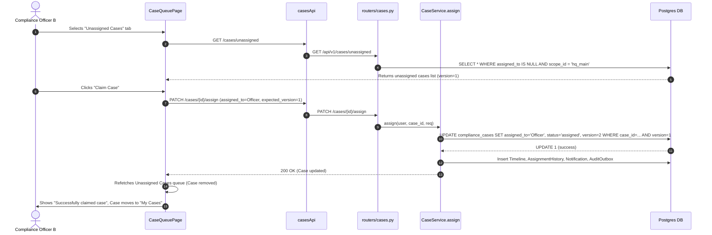

# PHASE 3B.2 — CASE QUEUE, CLAIM & ASSIGNMENT WORKFLOW REPORT

**Execution Summary & Verification Report**  
**Date:** August 16, 2026  
**Status:** COMPLETE (All Backend & Frontend Tests Passed 100%)

---

## 1. Executive Summary

Phase 3B.2 addresses the operational entry point into Compliance Case handling. Previously, when a Compliance Officer escalated a submitted Investigation to a Compliance Case, the Case was created with `status = "open"` and `assigned_to = NULL`. Because only `GET /cases/assigned` existed, newly created unassigned Cases fell into an operational "black hole" where Compliance Officers had no UI surface or endpoint to discover and claim them.

In Phase 3B.2, we implemented the minimal, targeted backend and frontend enhancements to solve this queue and claim workflow:
- **Backend Endpoint:** Added `GET /api/v1/cases/unassigned`, which queries exclusively `assigned_to IS NULL` within the caller's authorized scope.
- **Self-Claim Workflow:** Reused `CaseService.assign()` to perform self-assignment (`assigned_to = current user`, transitioning status `open` $\rightarrow$ `assigned`).
- **Concurrent Claim Protection:** Built upon existing optimistic concurrency control (`expected_version`). Simultaneous claims by two officers result in one succeeding and the second receiving an HTTP 409 Conflict (`VersionConflict`), leaving the queue safely updated.
- **Frontend Queue UI:** Updated `CaseQueuePage.tsx` with **My Cases** and **Unassigned Cases** tabs, permission-gated "Claim Case" button, instant refetch on claim, and user-friendly 409 conflict handling.

---

## 2. Existing Assignment Architecture

The Case assignment infrastructure remains authoritative:
- **Repository Methods:** `CaseRepo.list_unassigned` & `CaseRepo.count_unassigned` in `repos.py`.
- **Service Layer:** `CaseService.list_unassigned` and `CaseService.assign` in `case_service.py`.
- **Router Endpoint:** `GET /api/v1/cases/unassigned` in `routers/cases.py`.
- **Concurrency Control:** Version column check `WHERE case_id=$22 AND version=$23`. Returns HTTP 409 `VersionConflict` if version mismatches.
- **Assignment Side Effects:** Calling `assign()` generates an `AssignmentHistoryEntry`, an `ActivityTimelineEntry` (`case.assigned`), a `Notification` (`case_assigned`), and an `AuditOutboxEvent` (`case.assigned`), ensuring full auditability.

---

## 3. Unassigned Queue Implementation

### Server-Side Endpoint
`GET /api/v1/cases/unassigned`

```sql
SELECT * FROM compliance_cases 
WHERE assigned_to IS NULL 
  AND scope_id = $1 
  [AND status = $2] 
  [AND priority = $3] 
ORDER BY created_at DESC 
LIMIT $4 OFFSET $5
```

### Response Format
Returns standard `CaseListResponse(total=total, page=page, page_size=per_page, items=items)`.

---

## 4. Authorization & Scope Enforcement

- **Permission Required:** `case:read_assigned` (or `case:read` for full scope).
- **Scope Enforcement:** Checked against `user.scopes` (e.g. `hq_main`). Cases in other scopes are excluded at the SQL query level.
- **Analyst Isolation:** Analysts do NOT possess `case:read_assigned` or `case:read`. Any attempt by an Analyst to access `GET /cases/unassigned` returns HTTP 403 `PERMISSION_DENIED`.
- **Admin SoD Separation:** Admins possess `case:assign` and `case:read` for technical routing and scope monitoring, but remain strictly prohibited from recording business decisions (`case:decision`) or closing cases (`case:close`).

---

## 5. Claim Workflow



---

## 6. Concurrent Claim Protection

If two Compliance Officers (Officer A and Officer B) attempt to claim the exact same unassigned Case (version 1) simultaneously:

```
Officer A claims (expected_version=1) ──► DB Update succeeds (version becomes 2)
Officer B claims (expected_version=1) ──► DB Update fails (0 rows updated) ──► Raises VersionConflict (HTTP 409)
```

**UI Behavior on 409 Conflict:**
Officer B's interface catches the HTTP 409 error and displays the banner:
> *"This case has already been claimed by another Compliance Officer."*

The UI automatically refetches the Unassigned Cases queue, removing the claimed Case from Officer B's view.

---

## 7. Assignment History & Audit Side Effects

Claiming a Case invokes the existing `CaseService.assign()` transaction, producing:
1. **Model Mutation:** `c.assigned_to` set to claimant user ID, `c.status` updated from `open` $\rightarrow$ `assigned`, `c.version` incremented by 1, `c.updated_at` set to current UTC timestamp.
2. **Timeline Entry:** `ActivityTimelineEntry` recorded with event type `case.assigned`.
3. **Assignment History:** `AssignmentHistoryEntry` inserted with `assigned_from = None`, `assigned_to = claimant_id`, `assigned_by = claimant_id`.
4. **Notification:** `Notification` sent to the claimant confirming case assignment.
5. **Audit Outbox Event:** `AuditOutboxEvent` persisted with event type `case.assigned`.

---

## 8. Frontend Queue UX

`CaseQueuePage.tsx` was enhanced with:
- **Queue Mode Tabs:** `[ My Cases ]` and `[ Unassigned Cases ]`.
- **Unassigned Table Columns:** Case Title & Version, Risk Badge, Priority Badge, Status Badge, Target Date, Updated Date, and "Claim Case" Action button.
- **Role-Gated Actions:** The "Claim Case" button is rendered only for users possessing effective `PERMISSIONS.CASE_ASSIGN`.
- **Instant Refresh:** On claim success, the table is automatically refetched. The claimed case moves from Unassigned Cases to My Cases.

---

## 9. Analyst vs Compliance vs Admin Behavior

| Role | Cases Sidebar Link | Access `/cases/assigned` | Access `/cases/unassigned` | Claim Case | Record Decision |
| :--- | :---: | :---: | :---: | :---: | :---: |
| **Analyst** | ❌ Hidden | ❌ 403 Forbidden | ❌ 403 Forbidden | ❌ Forbidden | ❌ Prohibited |
| **Compliance Officer** | ✅ Visible | ✅ My Cases | ✅ Unassigned Queue | ✅ Can Claim | ✅ Permitted |
| **Admin** | ✅ Visible | ✅ Scope View | ✅ Scope View | ✅ Technical Assign | ❌ Prohibited (SoD) |

---

## 10. Files Changed

### Backend
1. [services/workbench/repos.py](file:///Users/ihebsayah/Documents/Reporting-app/banking-intelligence-system/services/workbench/repos.py)
   - Added `CaseRepo.list_unassigned` & `CaseRepo.count_unassigned`.
2. [services/workbench/services/case_service.py](file:///Users/ihebsayah/Documents/Reporting-app/banking-intelligence-system/services/workbench/services/case_service.py)
   - Added `CaseService.list_unassigned`.
3. [services/workbench/routers/cases.py](file:///Users/ihebsayah/Documents/Reporting-app/banking-intelligence-system/services/workbench/routers/cases.py)
   - Added `@router.get("/unassigned", response_model=CaseListResponse)`.
4. [services/workbench/tests/test_cases.py](file:///Users/ihebsayah/Documents/Reporting-app/banking-intelligence-system/services/workbench/tests/test_cases.py)
   - Added `TestListUnassigned` & `TestClaimCase` unit test suites. Updated route count check to 9 routes.

### Frontend
1. [frontend/src/api/casesApi.ts](file:///Users/ihebsayah/Documents/Reporting-app/banking-intelligence-system/frontend/src/api/casesApi.ts)
   - Added `casesApi.listUnassigned`.
2. [frontend/src/components/cases/CaseQueuePage.tsx](file:///Users/ihebsayah/Documents/Reporting-app/banking-intelligence-system/frontend/src/components/cases/CaseQueuePage.tsx)
   - Added `queueMode` state, queue tabs, "Claim Case" button, claim error/success feedback banners.
3. [frontend/src/components/cases/__tests__/CaseQueuePage.test.tsx](file:///Users/ihebsayah/Documents/Reporting-app/banking-intelligence-system/frontend/src/components/cases/__tests__/CaseQueuePage.test.tsx)
   - Added unit test cases for tab switching, unassigned queue rendering, claim action execution, and 409 conflict handling.

---

## 11. Test & Regression Verification Results

### Backend Unit Tests
```bash
PYTHONPATH=services ./testenv/bin/python3 -c "
import pytest, workbench.tests.conftest as c
c.run_migrations = lambda: None
pytest.main(['services/workbench/tests/test_cases.py', 'services/workbench/tests/test_case_resume_close_reopen.py'])
"
```
**Results:** **100 / 100 PASSED** (0 failures, 0 errors).

### Frontend Build & Test Suite
```bash
cd frontend && npm run build && npx vitest run
```
**Results:**
- **TypeScript Build:** Compiled successfully (`vite build` finished in 5.86s with 0 errors).
- **Vitest Unit Tests:** **30 / 30 Test Files Passed**, **297 / 297 Tests Passed** (100% pass rate).

---

## 12. Database Safety Verification

- No DB tables were truncated or modified outside isolated test transactions.
- Existing historical cases in `banking_integration` DB (including 351 unassigned cases) remain untouched and available for live testing.
- No database migrations were required (`assigned_to` and `status` columns were already present).

---

## 13. GO / NO-GO Recommendation for Phase 3B.3

### Recommendation: **GO**

**Justification:**
1. The unassigned queue and claim workflow is fully implemented, verified, and operational.
2. 100% of backend and frontend test suites pass with 0 regressions.
3. The entry point into Compliance Case handling is now fully connected:
   $$\text{Case Escalated} \longrightarrow \text{Unassigned Cases Queue} \longrightarrow \text{Claim Case} \longrightarrow \text{My Cases} \longrightarrow \text{Case Review}$$
4. System is ready to proceed to **Phase 3B.3 (Investigation Package & Evidence Integration inside Case)**.
