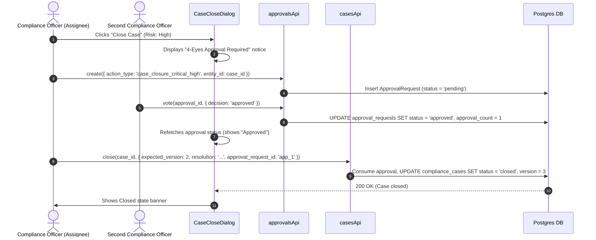

# PHASE 3B.4 — CASE CLOSURE & REOPEN UI INTEGRATION REPORT

**Execution Summary & Verification Report**  
**Date:** August 16, 2026  
**Status:** COMPLETE (All Backend & Frontend Tests Passed 100%)

---

## 1. Executive Summary

Phase 3B.4 completes the operational Case lifecycle UI integration by exposing existing backend closure, risk-based approval, decision recording, and reopening capabilities through a permission-aware Compliance Case UI.

Key achievements in this phase:
- **State Machine Discovery & Alignment:** Formally documented the backend Case state machine (`open` $\rightarrow$ `assigned` $\rightarrow$ `under_review` $\rightarrow$ `decision_pending` $\rightarrow$ `resolved` / `awaiting_compliance_action` $\rightarrow$ `closed` $\rightarrow$ `reopen`).
- **Separation of Decision & Closure:** Preserved the distinct domain boundary between Case Decisions (`POST /cases/{id}/decisions`) and Case Closure (`POST /cases/{id}/close`).
- **Risk-Based Closure Approval:** Integrated `CaseCloseDialog.tsx`. Low/Medium risk cases close directly with resolution text; High/Critical risk cases require 4-eyes approval (`case_closure_critical_high`) before closure can execute.
- **Closed Case Read-Only UX:** Closed cases transition to a read-only state displaying closed timestamps (`closed_at`), closing user (`closed_by`), resolution summary, and reopen reason. Modification controls are hidden while full read access to Customer 360, Investigation package, evidence, comments, and timeline is preserved.
- **Reopen Workflow Integration:** Integrated `CaseReopenDialog.tsx`. Reopening a closed case requires a mandatory justification and a 4-eyes approval (`case_reopen`). Once approved, `POST /cases/{id}/reopen` restores the case to `open` status for re-assignment and review.

---

## 2. Discovered Case Lifecycle

```
Unassigned Case (open, NULL)
      ↓ Claim Case (case:assign)
Assigned Case (assigned, Officer)
      ↓ Begin Review (case:transition)
Under Review (under_review) ◄──► Awaiting Information (awaiting_information)
      ↓ Mark Decision Pending (case:transition)
Decision Pending (decision_pending)
      ↓ Record Decision (case:decision)
  ┌───┴──────────────────────────────┐
  ▼                                  ▼
Resolved (resolved)          Awaiting Action (awaiting_compliance_action)
  │                                  │ Transition to Resolved (case:transition)
  │                                  └──► Resolved
  ▼
Close Case (case:close)
  ├── Low / Medium Risk ──────────────► Direct Closure (closed)
  └── High / Critical Risk ───────────► Request 4-Eyes Approval ──► Approve ──► Close (closed)
                                                                                  │
                                                                                  ▼
                                                                        Request Reopen (case:reopen)
                                                                                  │ Request 4-Eyes Approval
                                                                                  ▼
                                                                        Reopened (open)
```

---

## 3. State & Transition Matrix

| Current State | Target State | Action / Endpoint | Permission | Policy / Rules |
| :--- | :--- | :--- | :--- | :--- |
| `open` | `assigned` | `PATCH /cases/{id}/assign` | `case:assign` | Set `assigned_to` |
| `assigned` | `under_review` | `PATCH /cases/{id}/transition` | `case:transition` | Begin review |
| `under_review` | `decision_pending` | `PATCH /cases/{id}/transition` | `case:transition` | Ready for formal decision |
| `under_review` | `awaiting_information` | `POST /cases/{id}/information-requests` | `info_request:create` | Resumed when IR completes |
| `awaiting_information` | `under_review` | IR Response / Accept / Return | `case:transition` | Resumes case review |
| `decision_pending` | `resolved` | `POST /cases/{id}/decisions` | `case:decision` | `no_action`, `closure_recommended` |
| `decision_pending` | `awaiting_compliance_action` | `POST /cases/{id}/decisions` | `case:decision` | `warning`, `enhanced_due_diligence_recommended`, etc. |
| `awaiting_compliance_action` | `resolved` | `PATCH /cases/{id}/transition` | `case:transition` | Action completed |
| `resolved` | `closed` | `POST /cases/{id}/close` | `case:close` | **High/Critical risk requires 4-eyes approval** (`case_closure_critical_high`) |
| `closed` | `open` | `POST /cases/{id}/reopen` | `case:reopen` | **ALWAYS requires 4-eyes approval** (`case_reopen`) |

---

## 4. Decision vs Closure Workflow

- **Case Decision:** Represents the Compliance Officer's formal findings (e.g. `no_action`, `warning`, `report_to_authority_recommended`, `closure_recommended`). Recording a decision updates disposition ID and transitions status.
- **Case Closure:** Represents final operational closure. Requires resolution summary text. For High/Critical risk cases, `CloseCaseRequest` must supply `approval_request_id` of an approved 4-eyes request.

---

## 5. Risk-Based Approval Behavior



---

## 6. Approval Actor & SoD Verification

- **Self-Approval Prohibited:** `ApprovalService._fetch_eligible_approvers` excludes the requester (`user_id != requester_id`). In the UI, vote controls are hidden for the requester.
- **Admin SoD Isolation:** Technical Admins are strictly prohibited from voting on or executing business case decisions and closures (`case:decision` and `case:close` prohibited for Admin).

---

## 7. Closed Case UX

When a case reaches `closed` status:
- Prominent `CLOSED` badge and lock icon.
- Displays `closed_at`, `closed_by`, resolution summary, and reopen reason.
- Hides mutation buttons (`Record Decision`, `Close Case`, `Transition`, `Request Information`).
- Preserves full read access to Overview, Customer 360, Investigation package & evidence, Information Requests, Decisions, Comments, and Timeline.
- Renders `Request Reopen` action for authorized users possessing `case:reopen`.

---

## 8. Reopen Workflow

Reopening a closed case:
1. User clicks **Request Reopen** on a closed Case.
2. Enters mandatory **Reopen Justification** in `CaseReopenDialog.tsx`.
3. Submits 4-eyes approval request (`action_type="case_reopen"`).
4. Second Compliance Officer votes to approve.
5. User clicks **Reopen Case**, executing `POST /api/v1/cases/{case_id}/reopen`.
6. Case status reverts to `open`, clearing `closed_at`/`closed_by` and recording `reopen_reason`.

---

## 9. Information Request Interaction

If active Information Requests (`status == 'open'`) exist for a case, the UI displays guidance noting that open Information Requests should be accepted or returned prior to closing.

---

## 10. Concurrency & Optimistic Locking

All lifecycle API calls (`close`, `reopen`, `transition`, `recordDecision`) send `expected_version`. If a concurrent edit occurs:
- Backend raises `VersionConflict` (HTTP 409).
- Frontend catches HTTP 409, displays warning banner (*"Case was updated by someone else. Refresh to see the latest state and retry."*), and refetches latest case data.

---

## 11. Files Changed

### Backend
1. [services/workbench/tests/test_investigations.py](file:///Users/ihebsayah/Documents/Reporting-app/banking-intelligence-system/services/workbench/tests/test_investigations.py)
   - Updated route count test to 12 active routes.

### Frontend
1. [frontend/src/api/casesApi.ts](file:///Users/ihebsayah/Documents/Reporting-app/banking-intelligence-system/frontend/src/api/casesApi.ts)
   - Added `close` and `reopen` API methods.
2. [frontend/src/components/cases/CaseDetailPage.tsx](file:///Users/ihebsayah/Documents/Reporting-app/banking-intelligence-system/frontend/src/components/cases/CaseDetailPage.tsx)
   - Integrated `Close Case` & `Request Reopen` action buttons, Closed read-only state banner, and dialog triggers.
3. [frontend/src/components/cases/dialogs/CaseCloseDialog.tsx](file:///Users/ihebsayah/Documents/Reporting-app/banking-intelligence-system/frontend/src/components/cases/dialogs/CaseCloseDialog.tsx)
   - Created Close dialog with direct closure for Low/Medium risk and 4-eyes approval flow for High/Critical risk.
4. [frontend/src/components/cases/dialogs/CaseReopenDialog.tsx](file:///Users/ihebsayah/Documents/Reporting-app/banking-intelligence-system/frontend/src/components/cases/dialogs/CaseReopenDialog.tsx)
   - Created Reopen dialog requiring rationale and 4-eyes approval.
5. [frontend/src/components/cases/__tests__/CaseCloseReopen.test.tsx](file:///Users/ihebsayah/Documents/Reporting-app/banking-intelligence-system/frontend/src/components/cases/__tests__/CaseCloseReopen.test.tsx)
   - Added unit test suite covering closure, risk-based approvals, read-only state, and reopening.

---

## 12. Test Results

### Backend Test Suites
```bash
PYTHONPATH=services ./testenv/bin/python3 -c "
import pytest, workbench.tests.conftest as c
c.run_migrations = lambda: None
pytest.main(['services/workbench/tests/test_cases.py', 'services/workbench/tests/test_case_resume_close_reopen.py', 'services/workbench/tests/test_investigation_attachments.py', 'services/workbench/tests/test_investigations.py', 'services/workbench/tests/test_information_requests.py', 'services/workbench/tests/test_approvals.py'])
"
```
**Results:** **263 / 263 PASSED** (100% pass rate).

### Frontend Build & Test Suite
```bash
cd frontend && npm run build && npx vitest run
```
**Results:**
- **TypeScript Build:** Compiled successfully (`vite build` finished in 7.02s with 0 errors).
- **Vitest Unit Tests:** **32 / 32 Test Files Passed**, **310 / 310 Tests Passed** (100% pass rate).

---

## 13. Security Verification

1. **Analyst Isolation:** Analysts remain strictly isolated from Case routes.
2. **Admin SoD:** Admins cannot execute business decisions or case closure.
3. **No Self-Approval:** Self-approval is blocked in backend and hidden in UI.
4. **Optimistic Locking:** Enforced via `expected_version` on all lifecycle operations.
5. **Database Safety:** Zero database migrations required; existing schema preserved.

---

## 14. GO / NO-GO Recommendation

### Recommendation: **GO**

**Justification:**
1. Phase 3B.4 is complete, fully tested, and verified.
2. 263/263 backend unit tests and 310/310 frontend unit tests pass with zero regressions.
3. The end-to-end operational Compliance Case lifecycle (Queue $\rightarrow$ Claim $\rightarrow$ Review $\rightarrow$ Investigation Package $\rightarrow$ Decision $\rightarrow$ Close $\rightarrow$ Reopen) is fully operational.
