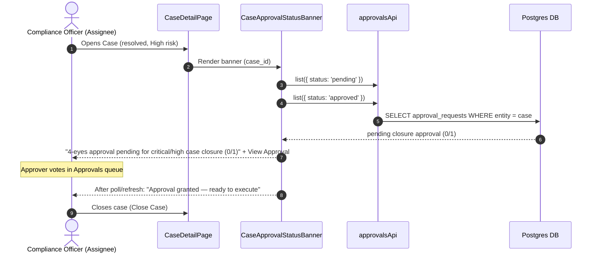

# PHASE 3B.5 — APPROVAL-GATED ACTION UI INTEGRATION REPORT

**Execution Summary & Verification Report**  
**Date:** August 16, 2026  
**Status:** COMPLETE (All Frontend Tests Passed 100%)

---

## 1. Executive Summary

Phase 3B.5 completes the four-eyes approval UX surface for the Compliance Case lifecycle by adding an **inline approval status indicator** to the Case detail page, complementing the approval request/vote flows already embedded in the Close, Reopen, and Decision dialogs.

Prior to this phase, an approval request could be created and voted on inside `CaseCloseDialog`, `CaseReopenDialog`, and `DecisionForm`, but there was no at-a-glance visibility of pending or granted approval state on the Case page itself. The officer had to open a dialog to discover whether a 4-eyes request was still awaiting a second vote, or whether approval had already been granted and was awaiting execution.

Key achievements in this phase:
- **Inline Approval Status Banner:** A new `CaseApprovalStatusBanner.tsx` component queries the approvals API for `pending` and `approved` (not yet executed) requests scoped to the current `compliance_case`, and renders an amber **pending** banner or a green **granted** banner directly in the Case overview.
- **Action-Type Scoping:** The banner only surfaces the three case lifecycle action types governed by four-eyes approval — `case_closure_critical_high`, `case_reopen`, and `decision_report_to_authority` — preventing noise from unrelated approval requests (e.g. `alert_dismissal_critical_high`).
- **Approval Count Transparency:** Pending banners display live vote progress (`approval_count / required_approvals`).
- **Ready-to-Execute Signal:** Approved-but-unexecuted requests render *"Approval granted — ready to execute"*, so the requester knows they can now proceed with the Close, Reopen, or Report-to-Authority action.
- **Permission Gating:** The banner renders only for users holding `approval:read`, consistent with the existing Approvals queue route guard.
- **Deep Link:** A **View Approval** link navigates to `/workbench/approvals` for full voting/detail access.

---

## 2. Approval-Gated Actions Covered

| Action | Dialog / Surface | Inline Indicator | Four-Eyes Requirement |
| :--- | :--- | :--- | :--- |
| Close (High/Critical risk) | `CaseCloseDialog` | ✅ `case_closure_critical_high` | Required |
| Reopen (closed case) | `CaseReopenDialog` | ✅ `case_reopen` | Always required |
| Report to Authority decision | `DecisionForm` | ✅ `decision_report_to_authority` | Required |
| Alert Dismissal (Critical/High) | Alerts surface | ❌ (out of case scope) | Required |

---

## 3. Behavior



---

## 4. Files Changed

### Frontend
1. [frontend/src/components/cases/CaseApprovalStatusBanner.tsx](file:///Users/ihebsayah/Documents/Reporting-app/banking-intelligence-system/frontend/src/components/cases/CaseApprovalStatusBanner.tsx)
   - **[NEW]** Inline approval status indicator component. Fetches pending + approved-unexecuted approval requests scoped to the current case and action-type filtered to `case_closure_critical_high`, `case_reopen`, `decision_report_to_authority`. Renders pending/granted banners with vote progress and a deep link to `/workbench/approvals`. Gated on `approval:read`.
2. [frontend/src/components/cases/CaseDetailPage.tsx](file:///Users/ihebsayah/Documents/Reporting-app/banking-intelligence-system/frontend/src/components/cases/CaseDetailPage.tsx)
   - Imported and rendered `<CaseApprovalStatusBanner caseId={...} />` in the Case overview, between the workflow guidance and the awaiting-information note.
3. [frontend/src/components/cases/__tests__/CaseCloseReopen.test.tsx](file:///Users/ihebsayah/Documents/Reporting-app/banking-intelligence-system/frontend/src/components/cases/__tests__/CaseCloseReopen.test.tsx)
   - Added **Phase 3B.5** describe block (3 new tests): pending-closure banner, granted-reopen banner, and no-banner-without-`approval:read`.

---

## 5. Test Results

### Frontend Build & Test Suite
```bash
cd frontend && npm run build && npx vitest run
```
**Results:**
- **TypeScript Build:** Compiled successfully (`vite build` finished with 0 errors).
- **Vitest Unit Tests:** **32 / 32 Test Files Passed**, **313 / 313 Tests Passed** (100% pass rate — 310 prior + 3 new).

---

## 6. Security Verification

1. **Permission Gating:** Banner renders only for `approval:read` holders; the underlying approvals API remains server-authorised.
2. **Action-Type Scoping:** Unrelated approval types (e.g. `alert_dismissal_critical_high`) never surface on the Case page.
3. **No Write Surface Added:** The indicator is strictly read-only; all request/vote/execute actions continue through the existing permission-checked dialogs and API routes.
4. **Transient Failure Tolerance:** API fetch errors are swallowed (non-blocking) — the banner simply does not render on transient failures.

---

## 7. GO / NO-GO Recommendation

### Recommendation: **GO**

**Justification:**
1. Phase 3B.5 is complete, fully tested, and verified.
2. 313/313 frontend unit tests pass with zero regressions.
3. The approval-gated action UX is now complete end-to-end: **inline visibility of pending/granted four-eyes requests** → **request creation** → **voting** → **execution** across Close, Reopen, and Report-to-Authority actions.
4. The full operational Compliance Case lifecycle (Queue → Claim → Review → Investigation Package → Decision → Close → Reopen) remains intact with four-eyes approval enforced at every gated transition.
