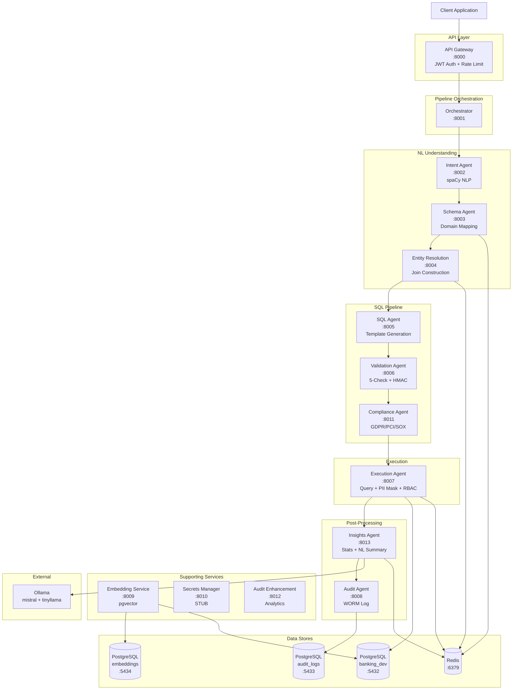
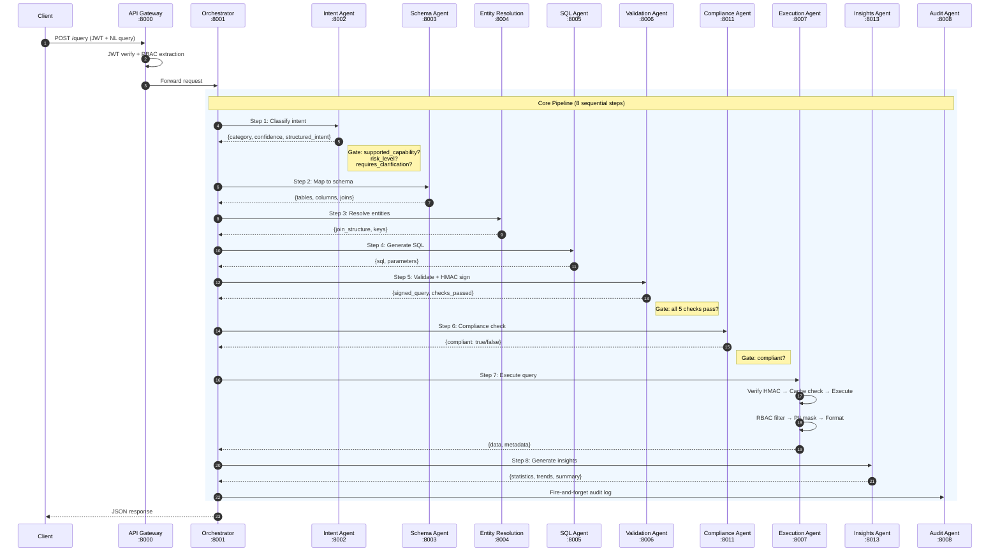
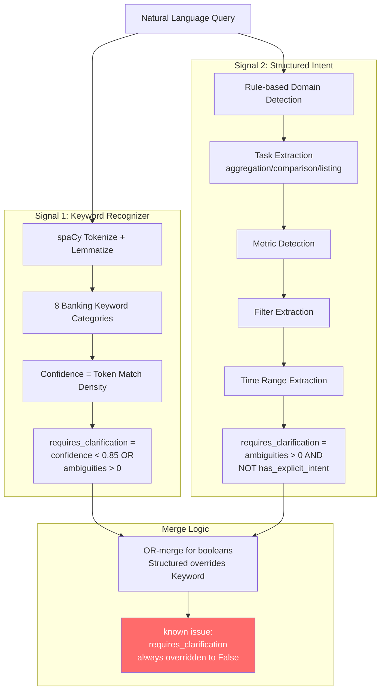
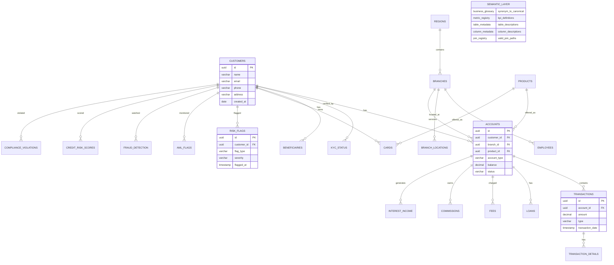
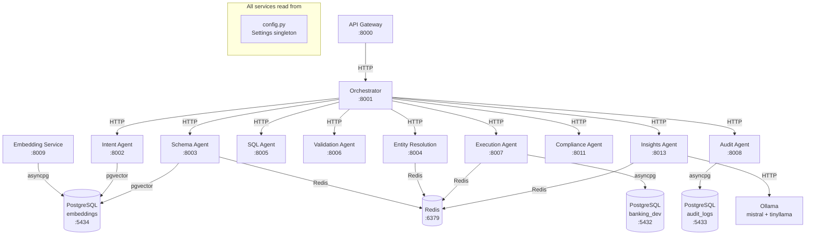
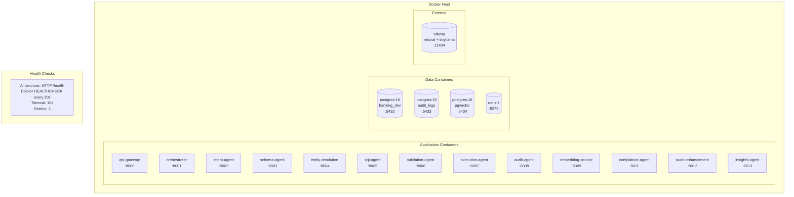
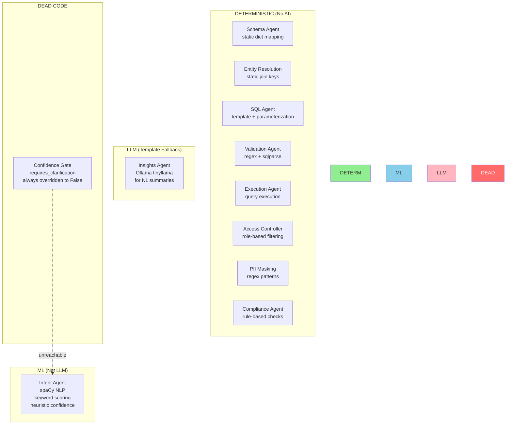

# Architecture Diagrams

**Date:** 2026-07-26
**Purpose:** Visual architecture documentation using Mermaid diagrams.
**Note:** Render these with any Mermaid-compatible viewer (GitHub, VS Code, mermaid.live).

---

## 1. High-Level System Architecture



---

## 2. Request Pipeline (8-Step Sequential Flow)



---

## 3. Security Defense Layers

```mermaid
graph LR
    subgraph "Layer 1: Authentication"
        JWT[JWT Token<br/>HS256]
    end

    subgraph "Layer 2: Intent Gate"
        ADVERSARIAL{Adversarial?<br/>Unsupported?<br/>Ambiguous?}
    end

    subgraph "Layer 3: SQL Validation"
        CHECK1[Syntax Check]
        CHECK2[SELECT-only]
        CHECK3[Keyword Blacklist]
        CHECK4[LIMIT Enforced]
        CHECK5[Pattern Detection<br/>22 regex]
    end

    subgraph "Layer 4: HMAC Signing"
        HMAC[SHA-256 HMAC<br/>Query Tamper Proof]
    end

    subgraph "Layer 5: RBAC"
        RBAC[Role-based<br/>Row + Column<br/>Filtering]
    end

    subgraph "Layer 6: PII Masking"
        PII[7 Column Types<br/>4 Roles]
    end

    subgraph "Layer 7: Compliance"
        COMPLIANCE[GDPR / PCI-DSS<br/>SOX / AML / KYC]
    end

    JWT --> ADVERSARIAL
    ADVERSARIAL -->|pass| CHECK1
    CHECK1 --> CHECK2 --> CHECK3 --> CHECK4 --> CHECK5
    CHECK5 -->|pass| HMAC
    HMAC --> RBAC --> PII --> COMPLIANCE

    style ADVERSARIAL fill:#ff6b6b,color:#fff
    style CHECK5 fill:#ffa500,color:#fff
    style HMAC fill:#4ecdc4,color:#fff
    style RBAC fill:#45b7d1,color:#fff
    style PII fill:#96ceb4,color:#fff
    style COMPLIANCE fill:#a8e6cf,color:#000
```



---

## 4. Intent Pipeline (Dual-Signal Merge)



---

## 5. Database Architecture



---

## 6. Service Communication Map



---

## 7. Deployment Architecture



---

## 8. Data Flow for a Single Query

```mermaid
flowchart TD
    START([User asks: "Show me top 10 customers by balance"]) --> GW[API Gateway<br/>JWT verify]
    GW --> ORCH[Orchestrator<br/>initialize pipeline]
    ORCH --> INTENT[Intent Agent<br/>classify: customer_analysis<br/>task: ranking<br/>metric: balance<br/>limit: 10]
    INTENT --> GATE{Gate Check}

    GATE -->|supported + no risk| SCHEMA[Schema Agent<br/>tables: customers, accounts<br/>domain: customers]
    GATE -->|unsupported| REJECT1[REJECT: unsupported]

    SCHEMA --> ENTITY[Entity Resolution<br/>join: customers.id = accounts.customer_id<br/>keys: customer_id]
    ENTITY --> SQL[SQL Agent<br/>SELECT c.name, SUM(a.balance)<br/>FROM customers c<br/>JOIN accounts a ON c.id = a.customer_id<br/>GROUP BY c.name<br/>ORDER BY SUM(a.balance) DESC<br/>LIMIT $1<br/>PARAMS: [10]]

    SQL --> VALID[Validation Agent<br/>✓ syntax OK<br/>✓ SELECT-only<br/>✓ no dangerous keywords<br/>✓ LIMIT present<br/>✓ no injection patterns<br/>HMAC signed]

    VALID --> COMPLY[Compliance Agent<br/>✓ GDPR: no PII in SELECT<br/>✓ PCI: no card data<br/>✓ SOX: audit trail OK]
    COMPLY --> EXEC[Execution Agent<br/>verify HMAC ✓<br/>cache miss<br/>execute query<br/>RBAC filter<br/>PII mask<br/>format JSON]

    EXEC --> INSIGHTS[Insights Agent<br/>statistics: count, avg, min, max<br/>context: above/below average<br/>trend: N/A (single period)<br/>summary: template]

    INSIGHTS --> AUDIT[Audit Agent<br/>fire-and-forget log]
    AUDIT --> RESPONSE([Response:<br/>{data: [...], insights: {...},<br/>metadata: {pipeline_steps: [...],<br/>confidence: 0.85}}])

    style REJECT1 fill:#ff6b6b,color:#fff
    style GATE fill:#ffa500,color:#fff
```

---

## 9. AI Reasoning Maturity Map


